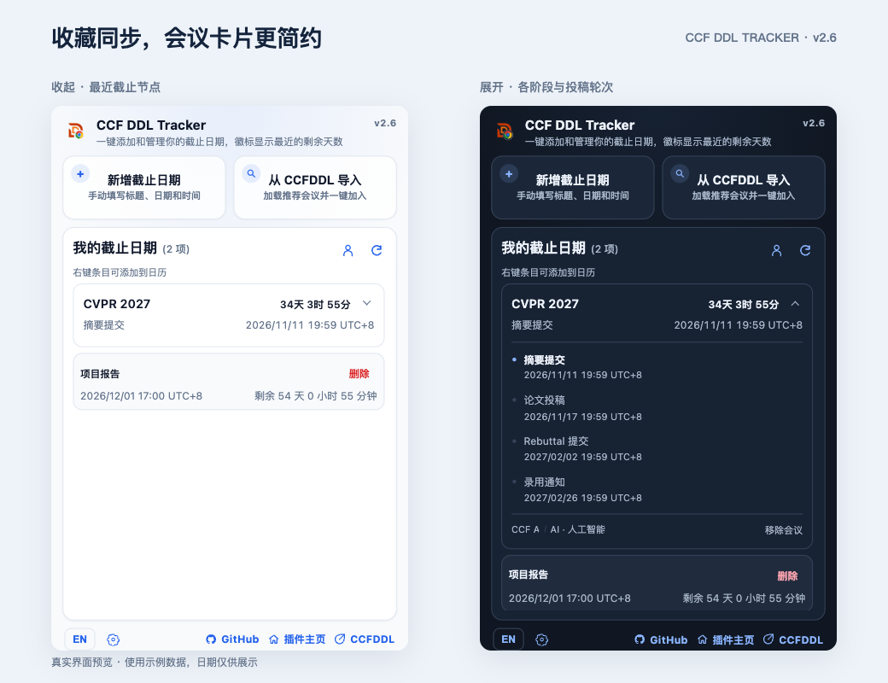

  

  # CCF DDL Tracker

  Chrome extension for tracking CCF deadlines with a compact popup, import flow, local storage, and optional CCFDDL star sync.

  **Version:** `v2.6`

  [中文版本](README.zh-CN.md) ·
  [GitHub Pages](https://jaychempan.github.io/ccf-ddl-tracker/) ·
  [Chrome Web Store](https://chromewebstore.google.com/detail/fnnpcnlkehcbickmdmepjpjimgcleidd?utm_source=item-share-cb) ·
  [Chrome Extension README](chrome/README.md) ·
  [CCFDDL Source](https://github.com/ccfddl/ccf-deadlines) ·
  [Repository](https://github.com/jaychempan/ccf-ddl-tracker)

---

## Preview

  

v2.6 connects your CCFDDL conference stars through the website’s GitHub login. Each conference edition gets one compact card showing its next deadline, with stages, submission rounds and calendar actions inside. The account icon stays beside My DDLs; sync runs automatically after connecting. Save failures and an unavailable background now have separate recovery prompts. The preview uses example dates, not live conference information.

This repository is versioned as v2.6 (manifest: `2.6.0`). Load it unpacked to try the changes; pushing source updates to GitHub does not update the Chrome Web Store package. Store distribution requires a separate submission and review.

---

## Install

### Chrome Web Store

Install directly from the Chrome Web Store:

  

### Load Unpacked

1. Open Chrome and visit `chrome://extensions/`.
2. Enable `Developer mode`.
3. Click `Load unpacked`.
4. Select the [`chrome/`](chrome/) directory in this repository.
5. Pin `CCF DDL Tracker` to the toolbar and click the icon to use it.

For an existing unpacked installation, update the same `chrome/` directory and click **Reload** at `chrome://extensions/` (or `edge://extensions/`). Reopen the popup and check for **v2.6**. Refresh any open ccfddl.com tabs before connecting stars. Keep the existing installed extension to retain local data.

  
Need more extension-specific details?

  See [chrome/README.md](chrome/README.md) for the extension-only guide.

---

## Highlights

- **Conference cards**: One card per edition shows the next deadline. Expand it for individual stages, rounds, calendar actions and removal.
- **Native popup experience**: Clicking the extension icon opens a compact Chrome popup instead of a separate window.
- **Manual + imported deadlines**: You can add custom deadlines or import recommended conferences from CCFDDL.
- **Official site shortcuts**: Imported conferences retain homepage links, and conference titles open the official website directly.
- **Conference tags**: Expanded conference cards show available CCF rank and category tags by default, with optional CORE, TH-CPL, and place fields in settings. Loading recommendations fills missing tags on matching older entries.
- **Calendar handoff**: Right-click saved or imported cards to send a deadline to Google Calendar or download ICS for Apple/iCloud and other calendar apps.
- **Bilingual UI**: Switch between Chinese and English from the bottom toolbar.
- **Display preferences**: Choose a display time zone, switch between `24-hour` and `12-hour`, and change date order between `YYYY/MM/DD` and `MM/DD/YYYY`.
- **Dark mode**: Follow system appearance by default, update immediately when it changes, or choose a fixed light or dark theme in settings.
- **Lighter startup and recovery**: Time-zone settings initialize on demand, date formatters are reused, and failed or timed-out local reads offer Retry without clearing saved deadlines.
- **Less background work**: The badge updates when its day count changes, when a deadline expires, and immediately after deadline edits. No deadline alarm is scheduled without upcoming items.
- **Reliable conference loading**: Direct HTTPS imports fall back to either working Chinese or English ICS feed, with 10-second request timeouts.
- **Tab fallback**: Right-click the extension icon and choose Options to open the same tracker and saved data in a regular tab.
- **Optional CCFDDL star sync**: Connect your signed-in CCFDDL website tab to merge conference stars with My DDLs. Manual deadlines remain local; no GitHub token is stored by the extension.

---

## Sync CCFDDL Stars

Click the small account icon beside **My DDLs** once to connect. An existing signed-in CCFDDL tab connects immediately; otherwise sign in with GitHub on the website that opens. Keep that tab open. Sync runs automatically every minute, when the website or tracker opens, and after local edits. The existing refresh button refreshes both deadlines and stars. Once connected, the same icon refreshes stars directly, without opening a menu; hover to see status. To disconnect, uncheck Sync website stars in Settings. Reload the website to display changes made in the extension.

The first connection merges both sets of conference stars. Stars represent an entire conference edition; upcoming abstract, submission, rebuttal and decision deadlines are imported into one collapsible conference card. The card shows the next upcoming date, with individual calendar actions and submission rounds inside. Import results are also grouped; Add conference saves all available dates together. Remove conference deletes the entire edition and unstars it when sync is enabled. Removing a single deadline hides that stage locally; removing the last saved deadline for that edition also removes its website star. Website unstars remove associated imported deadlines. Manual entries remain local. Older imports and fallback ICS entries without an edition ID remain local; re-add the corresponding conference from the current import list to link it. Unknown or TBD stars stay on the website and can be imported when dates become available.

Offline changes are retained for retry. Switching the website account pauses sync; disconnect and reconnect explicitly to merge the retained local conferences into another account. Disconnecting keeps local deadlines and website stars, but discards pending sync operations. Sync uses the website's existing HttpOnly session through an isolated content script; the extension stores the account login, pending conference IDs and sync state locally, never a GitHub token. No website/backend changes or additional extension permissions are required.

This connects CCFDDL conference stars, not GitHub repository stars. See the [v2.6.0 release notes](releases/v2.6.0.md) for upgrade details.

---

## Customization

- **Language**: Toggle between Chinese and English from the popup footer.
- **Appearance**: Choose System, Light, or Dark in settings. Your preference is saved locally.
- **Time zone**: Switch deadline display between supported time zones. The default is `Asia/Shanghai`.
- **Time format**: Choose `24-hour` or `12-hour (AM/PM)` in the settings panel.
- **Date order**: Choose `YYYY/MM/DD` or `MM/DD/YYYY`.
- **Conference tags**: Use Settings → Conference Tags to toggle visibility and choose fields. Saved opt-outs are preserved. For older entries with missing tags, click the import search field to load recommendations; only unique matches by conference title and deadline are filled.
- **Calendar actions**: Right-click a saved or imported deadline card to open the calendar menu.
- **Imported conference cards**: Imported items can be added to your own list and opened directly on the conference website.

---

## Add To Calendar

1. Open the popup and locate any saved or imported deadline card.
2. Right-click the card for its next deadline, or expand the conference and use a specific stage’s calendar icon.
3. Choose `Google Calendar` to open a prefilled event in the browser.
4. Choose `Apple / iCloud (.ics)` or `Download ICS` to import the deadline into calendar apps that support ICS files.

---

## Data Source & Privacy

- **Primary source**: [CCFDDL HTTPS YAML](https://ccfddl.com/conference/allconf.yml), maintained by [`ccfddl/ccf-deadlines`](https://github.com/ccfddl/ccf-deadlines)
- **Fallback**: Chinese and English CCFDDL ICS feeds; either working feed can recover a failed YAML request
- **Storage**: `chrome.storage.local`
- **Privacy**: local by default, optional CCFDDL account sync, no telemetry

---

## Development

- Repository: <https://github.com/jaychempan/ccf-ddl-tracker>
- Website source: [`website/`](website/)
- GitHub Pages URL: <https://jaychempan.github.io/ccf-ddl-tracker/>
- Chrome extension docs: [chrome/README.md](chrome/README.md)
- Tech stack: Manifest V3, Vanilla JavaScript, `chrome.storage.local`
- Contribution: Issues and pull requests are welcome

## Troubleshooting

If the toolbar popup stops opening in Edge or Chrome, see the [popup troubleshooting guide](chrome/POPUP-TROUBLESHOOTING.md#english). For Chrome on macOS, update at `chrome://settings/help` and relaunch to apply the official browser fix before testing recovery after an idle period. In v2.4, right-click icon → Options opens the tracker in a regular tab. Startup optimizations reduce extension-side work, but do not guarantee a fix when the browser does not display the popup or execute its JavaScript.

## Changelog

  
<strong>v2.6</strong> - Website-star sync, compact conference cards, and save recovery

  - Added opt-in CCFDDL conference-star sync through the website’s GitHub login. Connect from the small account icon beside My DDLs; subsequent sync is automatic and the existing refresh button also refreshes stars.
  - Merged deadlines by conference edition into compact cards. Show the next deadline first, expand stages and rounds, and add all available dates from one import result.
  - Added calendar and removal actions per stage, plus whole-conference removal. With sync enabled, removing the final saved stage or the whole conference also removes its website star.
  - Preserved source time zones and stage metadata when parsing conference editions, including fields declared after the timeline.
  - Serialized local writes and sync commits, retained offline changes, guarded account switches and stale responses, and kept manual deadlines local. No GitHub token entry or additional extension permissions are required.
  - Fixed save and background-connection errors being reported as local-read failures. Added extension reload for an unavailable background and list refresh before retrying an uncertain save.
  - Updated the bilingual website, guides, privacy policy and release preview. Expanded popup and sync regression coverage, including browser checks for upgrade recovery and retained data.

  
<strong>v2.5</strong> - Badge scheduling, smaller first view, and conference search recovery

  - Replaced one-minute badge polling with one-shot updates at day-count changes or deadline expiration, while deadline edits update immediately
  - Added alarm recovery, a 3-second background-read timeout, 5-minute failure retries, and protection against stale asynchronous updates
  - Preserved the original toolbar clock assets and drawing style
  - Deferred the theme script and removed synchronous Web Storage caching; saved themes load asynchronously using system colors while pending
  - Loaded YAML/ICS parsers on demand and resized the popup header image for its 28-pixel display, reducing first-view files by about 46% (203 KB to 109 KB)
  - Fixed conference imports to use direct HTTPS, recover from either calendar feed, and time out stalled requests and response bodies after 10 seconds
  - Skipped periodic local reads in hidden pages and expanded startup diagnostics; long-running browser popup failures still need validation
  - Expanded regression coverage to 26 popup, 24 background, and 4 theme scenarios, plus release consistency checks

  
<strong>v2.4</strong> - Appearance settings, faster startup, and popup troubleshooting

  - Added System (default), Light, and Dark appearance settings with local persistence
  - Applied dark colors to cards, forms, settings, search results, and calendar menus
  - Deferred full time-zone validation and settings options, reused date formatters, and combined preferences/deadlines into one startup read
  - Added a 3-second local-read timeout with error feedback and retry; malformed saved data is never automatically cleared
  - Documented the Chrome popup delay issue and a temporary browser launch option; this is not an extension-side fix
  - Added a regular-tab fallback via extension Options and Edge-specific troubleshooting steps
  - Updated Chrome/macOS recovery guidance to prioritize the official browser fix and recorded local update verification
  - Added 11 dependency-free popup regression tests and initialization timing marks for troubleshooting
  - Synced v2.4 copy across the website and bilingual docs, with release-version, translation, and local-link checks

  
<strong>v2.3</strong> - Manual links, remembered input, and footer shortcuts

  - Added optional card links when manually creating deadlines
  - Remembered the last opened add/import panel and unfinished add-form draft between popup opens
  - Changed the default countdown display to include hours and minutes
  - Refined footer shortcuts for GitHub, the extension home, and CCFDDL
  - Added CCF category and ranking metadata to imported conference browsing
  - Added optional settings to choose which conference metadata appears on saved cards
  - Included the selected conference metadata in Google Calendar and ICS exports

  
<strong>v2.2</strong> - Right-click calendar actions

  - Added a right-click context menu for deadline cards in the popup
  - Added direct export to Google Calendar from saved or imported deadline items
  - Added Apple / iCloud compatible `.ics` export and a generic ICS download action
  - Fixed list deletion so removing an item still targets the correct deadline after sorting

  
<strong>v2.1</strong> - Time zone switching and import time handling

  - Added a popup time zone selector with `Asia/Shanghai` as the default display zone
  - Manual deadlines are now saved using the currently selected time zone instead of the browser's local zone
  - Imported CCFDDL deadlines continue to respect their source time zone metadata when displayed
  - Improved ICS fallback parsing so `TZID` based timestamps are handled correctly when GitHub-hosted YAML is unavailable

  
<strong>v2.0</strong> - UI overhaul, import improvements, settings, and versioning

  - Reworked the popup into a denser layout with two entry cards and a bottom utility bar
  - Kept the import panel visible by default while moving recommendations into a floating search picker
  - Imported conferences now keep homepage links and added cards can open the official conference site
  - Added display settings for `24-hour / 12-hour` time and `year-month-day / month-day-year` date order
  - Added a `v2.0` version label in the popup header and bumped the extension version

  
<strong>v1.0.1</strong> - Refresh and day-count fixes

  - Fixed automatic date refresh issues
  - Added a manual refresh button
  - Corrected same-day deadlines to display `0 days`

---

## License

MIT License
