  

  # CCF DDL Tracker

  Chrome extension for tracking CCF deadlines with a compact popup, import flow, and local-only storage.

  **Version:** `v2.4`

  [中文版本](README.zh-CN.md) ·
  [GitHub Pages](https://jaychempan.github.io/ccf-ddl-tracker/) ·
  [Chrome Web Store](https://chromewebstore.google.com/detail/fnnpcnlkehcbickmdmepjpjimgcleidd?utm_source=item-share-cb) ·
  [Chrome Extension README](chrome/README.md) ·
  [CCFDDL Source](https://github.com/ccfddl/ccf-deadlines) ·
  [Repository](https://github.com/jaychempan/ccf-ddl-tracker)

---

## Preview

  

v2.4 keeps the compact popup and adds System / Light / Dark appearance settings, lighter startup with on-demand time-zone settings and reused date formatters, local-loading error feedback with Retry, and a regular-tab fallback through extension Options. Manual links, draft restoration, minute-level countdowns, conference metadata, and calendar exports remain available. The illustration above uses example data, not live conference deadlines.

This repository is versioned as v2.4. Load it unpacked to try the changes; pushing source updates to GitHub does not update the Chrome Web Store package. Store distribution requires a separate submission and review.

---

## Install

### Chrome Web Store

Install directly from the Chrome Web Store:

  

### Load Unpacked

1. Open Chrome and visit `chrome://extensions/`.
2. Enable `Developer mode`.
3. Click `Load unpacked`.
4. Select the [`chrome/`](chrome/) directory in this repository.
5. Pin `CCF DDL Tracker` to the toolbar and click the icon to use it.

  
Need more extension-specific details?

  See [chrome/README.md](chrome/README.md) for the extension-only guide.

---

## Highlights

- **Native popup experience**: Clicking the extension icon opens a compact Chrome popup instead of a separate window.
- **Manual + imported deadlines**: You can add custom deadlines or import recommended conferences from CCFDDL.
- **Official site shortcuts**: Imported conferences retain homepage links, and added cards can open the conference website directly.
- **Conference tags**: My DDLs shows available CCF rank and category tags by default, with optional CORE, TH-CPL, and place fields in settings. Loading recommendations fills missing tags on matching older entries.
- **Calendar handoff**: Right-click saved or imported cards to send a deadline to Google Calendar or download ICS for Apple/iCloud and other calendar apps.
- **Bilingual UI**: Switch between Chinese and English from the bottom toolbar.
- **Display preferences**: Choose a display time zone, switch between `24-hour` and `12-hour`, and change date order between `YYYY/MM/DD` and `MM/DD/YYYY`.
- **Dark mode**: Follow system appearance by default, update immediately when it changes, or choose a fixed light or dark theme in settings.
- **Lighter startup and recovery**: Time-zone settings initialize on demand, date formatters are reused, and failed or timed-out local reads offer Retry without clearing saved deadlines.
- **Tab fallback**: Right-click the extension icon and choose Options to open the same tracker and saved data in a regular tab.
- **Local-only data**: All data stays in `chrome.storage.local`, with no account or cloud sync.

---

## Customization

- **Language**: Toggle between Chinese and English from the popup footer.
- **Appearance**: Choose System, Light, or Dark in settings. Your preference is saved locally.
- **Time zone**: Switch deadline display between supported time zones. The default is `Asia/Shanghai`.
- **Time format**: Choose `24-hour` or `12-hour (AM/PM)` in the settings panel.
- **Date order**: Choose `YYYY/MM/DD` or `MM/DD/YYYY`.
- **Conference tags**: Use Settings → Conference Tags to toggle visibility and choose fields. Saved opt-outs are preserved. For older entries with missing tags, click the import search field to load recommendations; only unique matches by conference title and deadline are filled.
- **Calendar actions**: Right-click a saved or imported deadline card to open the calendar menu.
- **Imported conference cards**: Imported items can be added to your own list and opened directly on the conference website.

---

## Add To Calendar

1. Open the popup and locate any saved or imported deadline card.
2. Right-click the card to open the calendar menu.
3. Choose `Google Calendar` to open a prefilled event in the browser.
4. Choose `Apple / iCloud (.ics)` or `Download ICS` to import the deadline into calendar apps that support ICS files.

---

## Data Source & Privacy

- **Primary source**: [`ccfddl/ccf-deadlines`](https://github.com/ccfddl/ccf-deadlines)
- **Fallback**: CCFDDL ICS feeds when GitHub data is unavailable
- **Storage**: `chrome.storage.local`
- **Privacy**: no account, no cloud sync, no telemetry

---

## Development

- Repository: <https://github.com/jaychempan/ccf-ddl-tracker>
- Website source: [`website/`](website/)
- GitHub Pages URL: <https://jaychempan.github.io/ccf-ddl-tracker/>
- Chrome extension docs: [chrome/README.md](chrome/README.md)
- Tech stack: Manifest V3, Vanilla JavaScript, `chrome.storage.local`
- Contribution: Issues and pull requests are welcome

## Troubleshooting

If the toolbar popup stops opening in Edge or Chrome, see the [popup troubleshooting guide](chrome/POPUP-TROUBLESHOOTING.md#english). For Chrome on macOS, update at `chrome://settings/help` and relaunch to apply the official browser fix before testing recovery after an idle period. In v2.4, right-click icon → Options opens the tracker in a regular tab. Startup optimizations reduce extension-side work, but do not guarantee a fix when the browser does not display the popup or execute its JavaScript.

## Changelog

  
<strong>v2.4</strong> - Appearance settings, faster startup, and popup troubleshooting

  - Added System (default), Light, and Dark appearance settings with local persistence
  - Applied dark colors to cards, forms, settings, search results, and calendar menus
  - Deferred full time-zone validation and settings options, reused date formatters, and combined preferences/deadlines into one startup read
  - Added a 3-second local-read timeout with error feedback and retry; malformed saved data is never automatically cleared
  - Documented the Chrome popup delay issue and a temporary browser launch option; this is not an extension-side fix
  - Added a regular-tab fallback via extension Options and Edge-specific troubleshooting steps
  - Updated Chrome/macOS recovery guidance to prioritize the official browser fix and recorded local update verification
  - Added 11 dependency-free popup regression tests and initialization timing marks for troubleshooting
  - Synced v2.4 copy across the website and bilingual docs, with release-version, translation, and local-link checks

  
<strong>v2.3</strong> - Manual links, remembered input, and footer shortcuts

  - Added optional card links when manually creating deadlines
  - Remembered the last opened add/import panel and unfinished add-form draft between popup opens
  - Changed the default countdown display to include hours and minutes
  - Refined footer shortcuts for GitHub, the extension home, and CCFDDL
  - Added CCF category and ranking metadata to imported conference browsing
  - Added optional settings to choose which conference metadata appears on saved cards
  - Included the selected conference metadata in Google Calendar and ICS exports

  
<strong>v2.2</strong> - Right-click calendar actions

  - Added a right-click context menu for deadline cards in the popup
  - Added direct export to Google Calendar from saved or imported deadline items
  - Added Apple / iCloud compatible `.ics` export and a generic ICS download action
  - Fixed list deletion so removing an item still targets the correct deadline after sorting

  
<strong>v2.1</strong> - Time zone switching and import time handling

  - Added a popup time zone selector with `Asia/Shanghai` as the default display zone
  - Manual deadlines are now saved using the currently selected time zone instead of the browser's local zone
  - Imported CCFDDL deadlines continue to respect their source time zone metadata when displayed
  - Improved ICS fallback parsing so `TZID` based timestamps are handled correctly when GitHub-hosted YAML is unavailable

  
<strong>v2.0</strong> - UI overhaul, import improvements, settings, and versioning

  - Reworked the popup into a denser layout with two entry cards and a bottom utility bar
  - Kept the import panel visible by default while moving recommendations into a floating search picker
  - Imported conferences now keep homepage links and added cards can open the official conference site
  - Added display settings for `24-hour / 12-hour` time and `year-month-day / month-day-year` date order
  - Added a `v2.0` version label in the popup header and bumped the extension version

  
<strong>v1.0.1</strong> - Refresh and day-count fixes

  - Fixed automatic date refresh issues
  - Added a manual refresh button
  - Corrected same-day deadlines to display `0 days`

---

## License

MIT License
