  

  # CCF DDL Tracker

  轻量的 Chrome 扩展，用于管理 CCF 相关会议截止日期，支持手动添加、CCFDDL 导入和本地提醒。

  **版本:** `v2.5`

  [English Version](README.md) ·
  [GitHub Pages](https://jaychempan.github.io/ccf-ddl-tracker/) ·
  [Chrome Web Store](https://chromewebstore.google.com/detail/fnnpcnlkehcbickmdmepjpjimgcleidd?utm_source=item-share-cb) ·
  [Chrome 扩展说明](chrome/README.md) ·
  [CCFDDL 数据源](https://github.com/ccfddl/ccf-deadlines) ·
  [项目仓库](https://github.com/jaychempan/ccf-ddl-tracker)

---

## 预览

  

v2.5 将角标改为在剩余天数变化或 DDL 到期时更新，主题延后异步加载并移除同步 Web Storage 缓存，会议解析器按需加载。缩小顶部图片与延后解析将首屏文件从约 203 KB 降至 109 KB；会议搜索改用 HTTPS，并支持中英文日历独立回退和请求超时。原版工具栏小闹钟、外观设置和日历导出继续保留。上图为界面示意，使用示例数据，并非实时会议截止日期。

本仓库版本已更新为 v2.5（manifest：`2.5.0`），可通过“加载已解压的扩展程序”体验。推送源码到 GitHub 不会更新 Chrome 应用商店安装包，商店分发需要单独提交和审核。

---

## 安装

### Chrome Web Store

可直接从 Chrome 应用商店安装：

  

### 开发者模式安装

1. 打开 Chrome，进入 `chrome://extensions/`。
2. 打开 `开发者模式`。
3. 点击 `加载已解压的扩展程序`。
4. 选择本仓库下的 [`chrome/`](chrome/) 目录。
5. 固定到工具栏后点击图标即可使用。

  
需要更细的扩展说明？

  可查看 [chrome/README.md](chrome/README.md)。

---

## 核心功能

- **原生贴靠弹窗**：点击扩展图标后，会直接打开紧凑的 Chrome popup，而不是单独窗口。
- **手动添加 + 导入会议**：既可以新增自定义截止日期，也可以从 CCFDDL 导入推荐会议。
- **官网直达**：导入的会议会保留官网链接，加入列表后可直接点击打开会议官网。
- **会议标签**：我的截止日期默认显示已有的 CCF 等级和分类标签，可在设置中选择 CORE、TH-CPL 和地点；加载推荐会议时会补全可匹配的旧条目标签。
- **日历接力**：右键已保存或导入的卡片，可直接发往 Google Calendar，或下载适用于 Apple / iCloud 等日历的 ICS 文件。
- **中英双语**：可在底部工具栏中切换中文和英文界面。
- **显示设置**：支持显示时区切换、`24 小时 / 12 小时` 时间制，以及 `年月日 / 月日年` 日期顺序切换。
- **夜间模式**：默认跟随系统外观，系统切换时即时响应，也可在设置中固定为浅色或深色。
- **启动优化与恢复**：时区设置按需初始化，日期格式器复用；本地读取失败或超时时显示重试，不会清空已保存的截止日期。
- **减少后台工作**：角标在剩余天数变化、DDL 到期时更新，修改截止日期后立即更新；没有未来 DDL 时不安排定时任务。
- **会议加载恢复**：通过 HTTPS 直接导入，失败时回退至任一可用的中英文 ICS，每个请求设有 10 秒超时。
- **标签页备用入口**：右键扩展图标选择“选项”，在普通标签页中使用同一工具和同一份本地数据。
- **仅本地存储**：所有数据都保存在 `chrome.storage.local` 中，不依赖账号或云同步。

---

## 自定义

- **语言**：可在 popup 底部切换中文和英文。
- **外观**：在设置中选择“跟随系统 / 浅色 / 深色”，选择会自动保存到本机。
- **时区**：可在设置面板中切换截止时间显示时区，默认是 `Asia/Shanghai`。
- **时间制式**：可在设置面板中选择 `24 小时` 或 `12 小时（AM/PM）`。
- **日期顺序**：可切换 `YYYY/MM/DD` 或 `MM/DD/YYYY`。
- **会议标签**：在设置 → 会议标签中开关显示并选择字段。已保存的关闭选择会保留；旧条目缺少标签时，点击导入区搜索框加载推荐会议，会按会议标题和截止时间补全能够唯一匹配的条目。
- **日历操作**：可对已保存或导入的截止日期卡片点击右键，打开日历菜单。
- **导入会议卡片**：导入后的会议可加入个人列表，并支持直接跳转会议官网。

---

## 添加到日历

1. 打开 popup，找到任意一个已保存或已导入的截止日期卡片。
2. 对该卡片点击右键，打开日历菜单。
3. 选择 `Google Calendar` 可在浏览器中打开预填好的日历事件。
4. 选择 `Apple / iCloud (.ics)` 或 `下载 ICS 文件`，可导入到支持 ICS 的日历应用。

---

## 数据来源与隐私

- **主数据源**：[CCFDDL HTTPS YAML](https://ccfddl.com/conference/allconf.yml)，由 [`ccfddl/ccf-deadlines`](https://github.com/ccfddl/ccf-deadlines) 维护
- **回退数据源**：中英文 CCFDDL ICS，任一可用即可恢复 YAML 请求失败后的会议加载
- **存储方式**：`chrome.storage.local`
- **隐私**：无账号、无云同步、无遥测

---

## 开发

- 仓库：<https://github.com/jaychempan/ccf-ddl-tracker>
- 网站源码：[website/](website/)
- GitHub Pages 地址：<https://jaychempan.github.io/ccf-ddl-tracker/>
- Chrome 扩展说明：[chrome/README.md](chrome/README.md)
- 技术栈：Manifest V3、Vanilla JavaScript、`chrome.storage.local`
- 共同开发：欢迎提交 Issue 和 Pull Request

## 常见问题

如果 Edge 或 Chrome 的工具栏弹窗无法打开，请查看[弹窗卡顿排查指南](chrome/POPUP-TROUBLESHOOTING.md#中文)。macOS 上的 Chrome 优先在 `chrome://settings/help` 更新并重新启动，以应用浏览器官方修复，再测试闲置后的首次点击。v2.4 可通过右键图标 →“选项”在普通标签页中使用工具。启动优化减少扩展自身的工作量，但不能保证解决浏览器未显示弹窗或未执行 JavaScript 的问题。

## 更新日志

  
<strong>v2.5</strong> - 角标按需更新、首屏减重与会议搜索恢复

  - 取消每分钟角标轮询，改为在天数变化或 DDL 到期时单次更新，增删改后立即刷新
  - 增加定时任务恢复、后台读取 3 秒超时、失败后 5 分钟重试，以及异步旧结果覆盖保护
  - 保留原版工具栏小闹钟资源、大小和绘制样式
  - 延后执行主题脚本，移除同步 Web Storage 缓存；主题偏好异步加载，等待期间使用系统配色
  - YAML/ICS 解析器按需加载，顶部图片按 28 像素显示尺寸优化，首屏文件约减少 46%（203 KB 降至 109 KB）
  - 修复会议导入：直连 HTTPS，中英文日历独立回退，请求及响应正文读取超过 10 秒时超时
  - 隐藏页面跳过定时读取，并增加启动诊断；浏览器长期运行后的弹窗故障仍需验证
  - 扩展为 26 项弹窗、24 项后台和 4 项主题回归场景，并保留发布一致性检查

  
<strong>v2.4</strong> - 外观设置、启动优化与弹窗卡顿排查

  - 新增“跟随系统（默认）/ 浅色 / 深色”外观设置，并保存在本机
  - 卡片、表单、设置、搜索结果和日历菜单适配深色
  - 弹窗启动不再批量校验所有时区；设置选项按需构建，日期格式器复用，偏好和截止日期合并读取
  - 本地读取增加 3 秒超时、错误提示和重试；异常数据不会被自动清空
  - 补充 Chrome 弹窗延迟问题和临时启动参数说明；这不是扩展内部的修复
  - 新增通过扩展“选项”在普通标签页打开工具的备用入口，以及 Edge 排查步骤
  - 更新 Chrome/macOS 恢复指南，优先应用浏览器官方修复，并记录本机更新验证
  - 新增 11 项无依赖弹窗回归测试和初始化计时，便于排查加载问题
  - 同步官网及中英文文档的 v2.4 内容，并增加版本、翻译和本地链接一致性检查

  
<strong>v2.3</strong> - 手动链接、输入记忆与底部入口优化

  - 手动新增截止日期时，可填写可选卡片链接
  - 记住上次打开的新增 / 导入面板，并在下次打开 popup 时恢复未完成的新增表单草稿
  - 默认倒计时显示改为包含小时和分钟
  - 优化底部快捷入口，区分 GitHub、插件主页和 CCFDDL
  - 导入会议浏览列表新增 CCF 分类和等级信息
  - 新增可选设置，可选择哪些会议元信息显示在已保存卡片中
  - 导出到 Google Calendar 或 ICS 时会带上已选择的会议元信息

  
<strong>v2.2</strong> - 右键日历菜单

  - 为 popup 中的截止日期卡片新增右键上下文菜单
  - 支持把保存或导入的条目直接添加到 Google Calendar
  - 支持导出适用于 Apple / iCloud 的 `.ics` 文件，并提供通用 ICS 下载
  - 修复列表排序后删除条目可能删错目标的问题

  
<strong>v2.1</strong> - 时区切换与导入时间处理增强

  - 新增 popup 时区选择器，默认显示时区为 `Asia/Shanghai`
  - 手动添加截止日期时，会按当前选中的时区解释并保存时间，而不是依赖浏览器本地时区
  - 从 CCFDDL 导入的截止日期会继续保留原始时区语义，再按当前显示时区渲染
  - 修复 ICS 回退数据源的 `TZID` 时间解析，避免 GitHub YAML 不可用时出现导入时间偏差

  
<strong>v2.0</strong> - 界面重构、导入优化、设置增强与版本标识

  - 重构 popup 布局，改为更紧凑的双入口卡片和底部工具栏
  - 导入面板默认常驻，搜索框点击后弹出悬浮推荐列表
  - 导入会议支持保留官网链接，加入“我的截止日期”后可点击卡片打开官网
  - 新增显示设置，支持 `24 小时 / 12 小时` 和 `年月日 / 月日年` 两组偏好
  - 弹窗右上角增加 `v2.0` 版本标记，并同步升级扩展版本号

  
<strong>v1.0.1</strong> - 刷新与剩余天数修复

  - 修复日期无法自动更新的问题
  - 新增手动刷新按钮
  - 修正当天截止任务显示为 `0 天`

---

## License

MIT License
